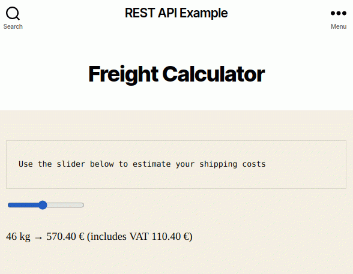

# How does one use the Wordpress API?

The [WP manual] explains it. Let's try it in practice.

The toy example adds a new page with an imaginary freight calculator where you
can select the weight of your shipment and get a shipping cost estimate.

The calculator is a web app that gets data from the Wordpress REST API and uses
that data to calculate the result based on the user's input.

The data is stored in custom field (metadata) values on a Wordpress page. The
values are exposed through the Wordpress REST API with a little help from a
plugin.


## Running & configuring Wordpress

1. Run `docker-compose up -d` in this folder.
1. Browse to http://localhost:9080 and run through the setup.
1. Go to `Plugins` > `Add New` and install a plugin called [REST API Custom
   Fields].
1. Activate the plugin in `Plugins` > `Installed plugins`.


## Create the content that uses custom fields

The following will add the custom fields to the same page where the Javascript
app uses them, but the fields could be added to any another page as well.

1. Create a new page (`Pages` > `Add new`)
1. In the editor's top right corner, click the ⋮ (vertical ellipsis) button to
   bring up a menu.
   1. Select `Options`.
   1. In the `Advanced panels` section, check `Custom fields`.
   1. Click `Enable & Reload`.
1. Add the draft title and text to your new page.
   1. Title: `Freight calculator`.
   1. Content: `Use the slider below to estimate your shipping costs`.
   1. Save draft.
1. Bring up the `Custom fields` panel at the bottom of the page editor.
1. Add a new custom field:
   1. Name: `price`
   1. Value: `{ "fi": 3.14, "gb": 2.80 }`
   1. Click `Add Custom Field`
1. Add another new custom field:
   1. Name: `vat`
   1. Value: `{ "fi": 24.0, "gb": 20.0 }`
   1. Click `Add Custom Field`
1. Publish the page, make a note of the page id (if the address is
   http://localhost:9080/?page_id=5, then the page id is 5).
1. Go to `Settings` > `REST API Custom Fields`
   1. Find the `price` and `vat` fields on the page and check the checkboxes.
   1. Save settings
1. Go back to edit the page `Freight calculator`
   1. Add a `Custom HTML` element.
   1. Copy-paste the code from [customHtmlElement.html](./src/customHtmlElement.html)
      into the field.
   1. In the script, update the variable `pageId` to match the actual
      page id.


## Updating the custom field values

As time passes and things change, so will you at some point need to update the
values that are used by your app.

To edit the custom field values
1. In the WP Admin view, go to `Pages` and start editing the Freight calculator
   page.
1. In the editor, scroll all the way down, so you can see the Custom Fields.
1. Edit the values to match current levels and click `Update`.


## End result

If everything went well, the page looks like this:



And the response to `GET http://localhost:9080/?rest_route=/wp/v2/pages/5` looks like this:
```json
{
    "id": 5,
    ...
    "price": "{ \"fi\": 10.0, \"gb\": 2.80 }",
    "vat": "{ \"fi\": 24.0, \"gb\": 20.0 }",
    ...
}
```


[WP manual]: https://developer.wordpress.org/rest-api/
[REST API Custom Fields]: https://wordpress.org/plugins/rest-api-custom-fields/
